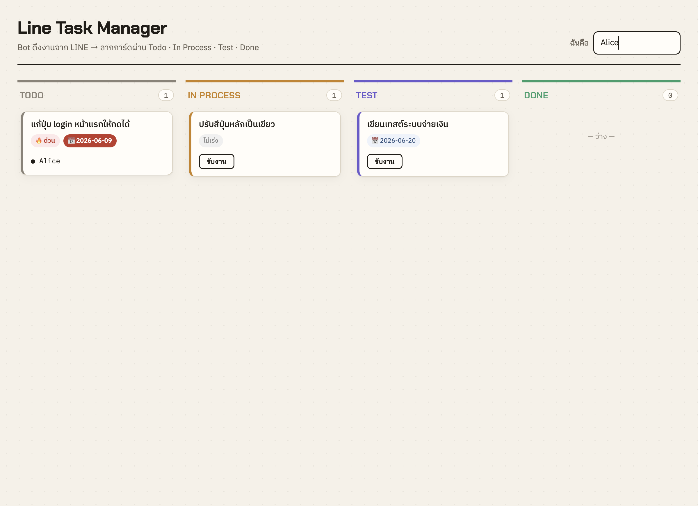
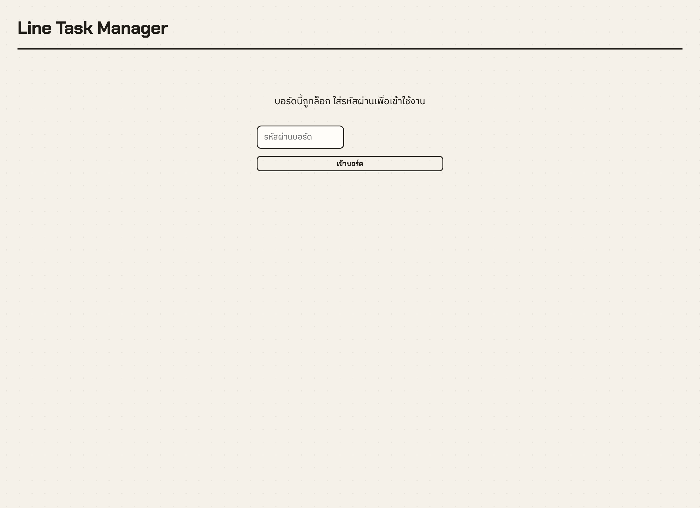

# Hardening Pass — CEO/CTO Review Follow-up

This pass fixes the concrete defects raised in the architecture/security review. LINE Login and
multi-tenant per-group isolation remain on the roadmap (they require external OAuth configuration
and a product decision on how a web board user maps to a LINE group) and were intentionally not
half-implemented.

## What changed

| # | Severity | Fix | Where |
|---|---|---|---|
| 1 | High | Position writes (`createTask`, `move`, `updateStatus`) are now atomic — wrapped in a transaction and serialized per-column with `pg_advisory_xact_lock`, so concurrent drags/intakes can't corrupt ordering | `database/database.service.ts`, `tasks/tasks.repository.ts` |
| 2 | Medium | Invalid status returns `400 Bad Request` instead of `404` | `tasks/tasks.service.ts` |
| 3 | Medium | Per-IP rate limiting on the board API (`@nestjs/throttler`); webhook + `/health` exempt | `app.module.ts`, `webhook/`, `health/` |
| 4 | Low | Board key / WebSocket key compared in constant time (`crypto.timingSafeEqual`) | `auth/board-key.guard.ts`, `realtime/events.gateway.ts` |
| 5 | Cost | Default AI extraction model switched to `claude-haiku-4-5` (override for accuracy) | `tasks/task-extraction.service.ts` |
| 6 | Low | Overdue check is timezone-agnostic (string compare, not UTC-midnight `Date`) | `frontend/.../TaskCard.tsx` |
| 7 | Tests | Added DB integration tests for ordering/concurrency + more extractor unit tests; CI now runs integration tests against a Postgres service | `backend/test/`, `.github/workflows/ci.yml` |

## Verification

- Backend unit tests: **16 passed**
- Backend integration tests (real Postgres): **4 passed** — incl. concurrent `createTask` producing distinct positions and concurrent `move` keeping positions contiguous `0..n-1`
- Frontend type-check + build: **clean**
- Live API checks: bad status → `400`; 130 rapid requests → `114×200 / 16×429`; `/health` → `200` under load; board key: no/wrong → `401`, correct → `200`

## Screenshots

Board with cards across all four columns — priority badges, due dates, an **overdue** card (due
2026-06-09 < today, rendered in red, demonstrating the timezone-safe fix), and an assignee:

Board locked by `BOARD_PASSWORD` — access is gated by the constant-time key guard:

